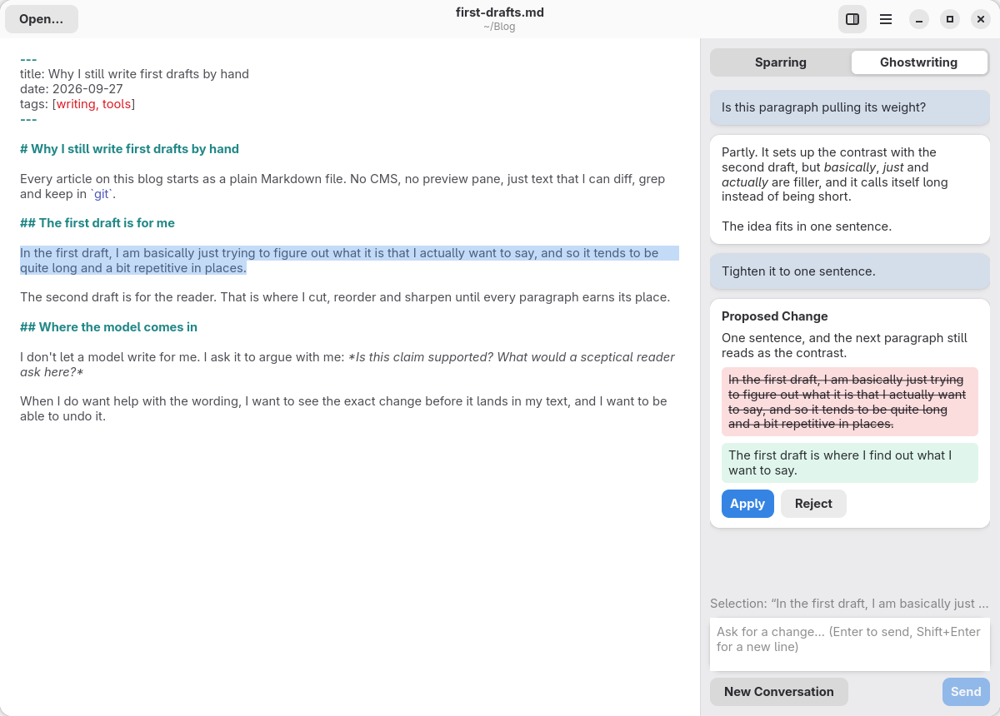

# Counterpoint

A Markdown editor for writing blog articles and social media posts with an LLM at your side.
Highlight a passage and choose how the model helps:

- **Sparring:** it reads your draft and pushes back: weak arguments, unclear sentences, missing
  points. Your text stays untouched.
- **Ghostwriting:** it proposes concrete edits. Review the before/after preview, then apply or
  reject; an applied change is a single undo step.

Counterpoint works with any OpenAI-compatible endpoint, local (Ollama, llama.cpp) or hosted, and
saves your Markdown exactly as you wrote it. Built with Rust, GTK 4 and libadwaita.

<picture>
  <source media="(prefers-color-scheme: dark)" srcset="docs/screenshots/dark.png">
  
</picture>

## Install

Counterpoint is early in development. Each
[GitHub release](https://github.com/marcusleg/counterpoint/releases) carries two packages for
x86_64:

- A **Flatpak bundle** for any distribution with Flatpak. Installing it also fetches the GNOME
  runtime from Flathub:

  ```sh
  flatpak install --user counterpoint-<version>-x86_64.flatpak
  flatpak run de.marcusleg.Counterpoint
  ```

  The bundle does not update itself. To update, install the next release's bundle with
  `--reinstall` added; your settings are kept. Inside the sandbox, Counterpoint can reach the
  network but sees only the files you open, save, drop on the editor or open from a file
  manager.

- An **RPM** for the current Fedora release and the one before it (Fedora 44 and 43):

  ```sh
  sudo dnf install ./counterpoint-<version>-1.x86_64.rpm
  ```

To build from source instead, see [Build from source](#build-from-source).

## Privacy

Every chat message sends the whole document text (front matter and HTML comments included),
the highlighted passage and the conversation so far to the configured endpoint. With a hosted
provider, that is a third party. Nothing else is sent: not the file name, path or any settings.

The model is told to treat the document as the writer's material rather than as instructions,
but a document you did not write can still contain text that steers the model. Read a proposal
before applying it, as you would anyway.

## Build from source

You need Rust 1.92 or newer, plus GTK 4.18, libadwaita 1.8 and GtkSourceView 5.12 or newer with
their development files:

```sh
sudo dnf install gtk4-devel libadwaita-devel gtksourceview5-devel   # Fedora
cargo run --release
```

To try it without a real model, run `python3 dev/mock_llm_server.py` and set the base URL in
**Preferences** to `http://127.0.0.1:8765/v1`. The model `mock` answers both modes; the others
(`mock-stale`, `mock-error-500`, `mock-slow`, …) exercise failure paths and are listed in the
script's docstring.

## Development checks

```sh
cargo fmt --check
cargo clippy --all-targets -- -D warnings
dev/headless.sh cargo test
```

`dev/headless.sh` runs the tests on a private GTK Broadway display and session bus, so no window
appears and your settings stay untouched. It needs `XDG_RUNTIME_DIR`, `gtk4-broadwayd` (Fedora
package `gtk4`) and `dbus-run-session` (`dbus-daemon`). Without a display, the GTK tests print
`SKIPPED: no display`. CI runs the same checks in a Fedora container.

To check that your own files survive loading and saving byte for byte, list them in
`COUNTERPOINT_ROUNDTRIP_FILES`, separated by colons:

```sh
COUNTERPOINT_ROUNDTRIP_FILES=post.md:notes.md dev/headless.sh cargo test --test gtk_editor
```

The test fixtures come from `python3 tests/fixtures/generate.py`; CI checks that the committed
ones match. After a visible change to the window, regenerate the screenshots with
`dev/screenshot.sh` (needs `mutter`).

## Releases

To release, set the new version in `Cargo.toml`, commit, and push a matching tag:

```sh
git tag v0.1.0
git push origin v0.1.0
```

`.github/workflows/release.yml` then builds the Flatpak bundle (from
`build-aux/de.marcusleg.Counterpoint.yml`, in Flathub's GNOME 51 build container) and the RPM
(with `cargo generate-rpm` and the metadata in `Cargo.toml`, in a Fedora 43 container) and
attaches both to a new release. The RPM is built on the older of the two supported Fedora
releases so that it installs on both; when a new Fedora is released, move that container up.
A version with a suffix such as `0.2.0-rc.1` becomes a pre-release. Running the workflow by
hand builds both packages as workflow artifacts without releasing anything.

To build and install the Flatpak locally (needs `flatpak-builder` and the Flathub remote):

```sh
flatpak-builder --user --install --install-deps-from=flathub --force-clean \
    target/flatpak build-aux/de.marcusleg.Counterpoint.yml
```

The desktop file, AppStream metainfo and icon both packages install are in `data/`.
